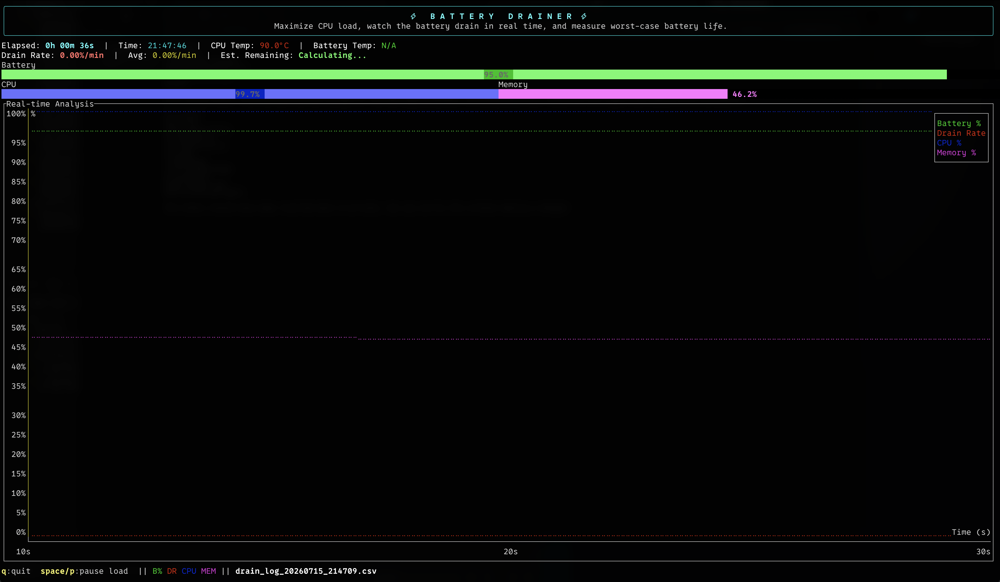

# batteryDrainTest

[](https://github.com/iamteedoh/batteryDrainTest/actions/workflows/ci.yml)

[](https://github.com/sponsors/iamteedoh)
[](https://patreon.com/iamteedoh)
[](https://buymeacoffee.com/iamteedoh)

A terminal-based battery drain testing and monitoring tool built in Rust. It
intentionally drains a laptop battery by pinning every CPU core while showing
a live TUI of battery percentage, drain rate, CPU/memory usage, and
temperatures — and logs everything to CSV for later playback.

The application lives in the [`battery-drainer/`](battery-drainer/) crate. See
[battery-drainer/README.md](battery-drainer/README.md) for full documentation:
features, architecture, UI layout, controls, and the CSV log format.

<p align="center">
  
</p>

## Quick start

```bash
git clone https://github.com/iamteedoh/batteryDrainTest.git
cd batteryDrainTest/battery-drainer

# Drain mode (unplug the charger first)
cargo run --release

# Plot mode: replay a recorded log
cargo run --release -- --plot drain_log_YYYYMMDD_HHMMSS.csv
```

Press `q` to quit either mode.

## Safety

Drain mode maximizes CPU usage and heat generation on purpose. Thermal
protection relies on your OS and hardware limits — monitor temperatures, and
avoid extended runs, which can accelerate battery wear.

## License

This project is licensed under the [GNU General Public License v3](LICENSE).

## Contributing

Contributions are welcome — see [CONTRIBUTING.md](CONTRIBUTING.md) for local
setup, the validation suite, and the pull request process.

## Security

To report a vulnerability privately, follow [SECURITY.md](SECURITY.md). Do not
open public issues for security problems.
