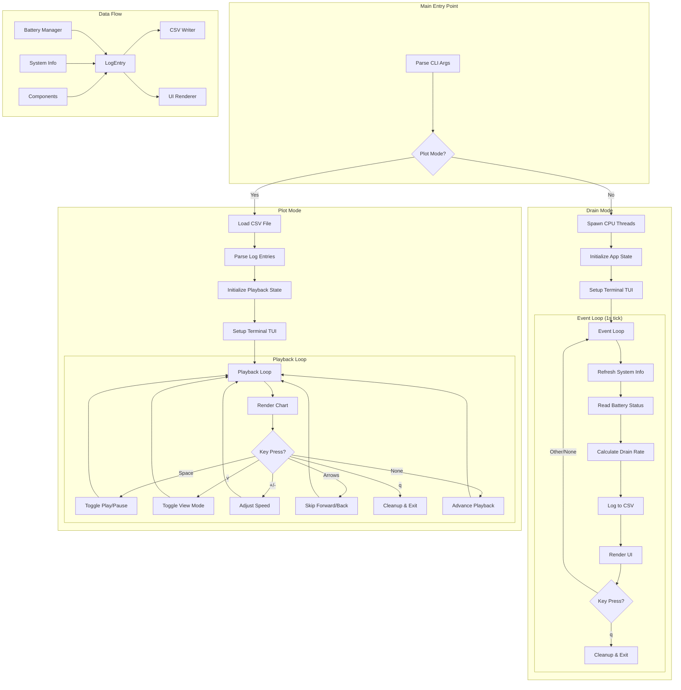

# Battery Drainer

A terminal-based battery drain testing and monitoring tool built in Rust. This application intentionally drains your laptop battery by maximizing CPU usage while providing real-time visualization of battery status, system metrics, and drain rate analytics.

## Features

- **CPU Load Generation**: Spawns CPU-intensive threads on all available cores
- **Real-time Monitoring**: Battery percentage, drain rate, CPU/memory usage, temperatures
- **Live Visualization**: TUI-based charts and gauges using Ratatui
- **Data Logging**: Automatic CSV logging for later analysis
- **Playback Mode**: Review historical data with VCR-like controls
- **Drain Rate Calculation**: Rolling 30-second window for accurate measurements
- **Time Estimation**: Estimates remaining battery life based on current drain rate

## How It Works

### CPU Load Generation

The application creates maximum CPU load by spawning one thread per CPU core, each running an infinite loop of floating-point calculations:

```rust
for _ in 0..num_cpus::get() {
    thread::spawn(move || {
        let mut x = 0.0f64;
        loop {
            x = (x + 1.0).sqrt();
        }
    });
}
```

This method:
- Utilizes 100% of all CPU cores
- Generates significant heat
- Drains the battery at maximum rate
- Allows measuring worst-case battery life

### Monitoring Stack

| Component | Source | Refresh Rate |
|-----------|--------|--------------|
| Battery % | `battery` crate | 1 second |
| Drain Rate | Calculated (30s window) | 1 second |
| CPU Usage | `sysinfo` crate | 1 second |
| Memory Usage | `sysinfo` crate | 1 second |
| CPU Temperature | `sysinfo` Components | 1 second |
| Battery Temperature | `battery` crate | 1 second |

## Architecture



## Dependencies

```toml
[dependencies]
ratatui = { version = "0.26.0", features = ["all-widgets"] }
crossterm = "0.27.0"
battery = "0.7.8"
num_cpus = "1.16.0"
clap = { version = "4.5.4", features = ["derive"] }
sysinfo = "0.30.12"
chrono = "0.4.38"
csv = "1.3.0"
serde = { version = "1.0", features = ["derive"] }
```

## Installation

### Prerequisites

- Rust toolchain (1.70+)
- A laptop with a battery

### Build from Source

```bash
# Clone the repository
cd battery-drainer

# Build release version
cargo build --release

# The binary will be at ./target/release/battery-drainer
```

## Usage

### Drain Mode (Default)

Run the application to start draining the battery and monitoring:

```bash
cargo run --release
```

Or run the compiled binary:

```bash
./target/release/battery-drainer
```

#### Drain Mode UI Layout

```
┌─────────────────────────────────────────────────────────────────┐
│ Time: 14:32:45  |  CPU Temp: 72.5°C  |  Battery Temp: 38.2°C    │
│ Drain Rate: 1.25%/min  |  Avg: 1.18%/min  |  Est. Remaining: 1h │
├─────────────────────────────────────────────────────────────────┤
│ Battery [████████████████████████░░░░░░░░░░░░░░░░░░] 62.5%      │
├─────────────────────────────────────────────────────────────────┤
│ CPU [████████████████████████████████████████] 98.2%            │
│ Memory [██████████████░░░░░░░░░░░░░░░░░░░░░░░░] 42.1%           │
├─────────────────────────────────────────────────────────────────┤
│                     Real-time Analysis                           │
│ 100%│ ─────────────────────────────────────────                 │
│     │      ╲                                                     │
│  50%│       ╲____  Battery %                                    │
│     │            ╲___                                           │
│   0%└──────────────────────────────────────────                 │
│     0s          30s          60s         90s                    │
├─────────────────────────────────────────────────────────────────┤
│ B% | DR | CPU | MEM || Logging to: drain_log_20260114.csv       │
└─────────────────────────────────────────────────────────────────┘
```

#### Drain Mode Controls

| Key | Action |
|-----|--------|
| `q` | Quit and save log |

### Plot Mode (Playback)

Review previously recorded data:

```bash
cargo run --release -- --plot drain_log_20260114_143256.csv
```

#### Plot Mode Controls

| Key | Action |
|-----|--------|
| `v` | Toggle Static View / Playback Mode |
| `Space` | Play / Pause |
| `+` or `=` | Speed up (2x, 4x, 8x... up to 64x) |
| `-` | Slow down (0.5x, 0.25x) |
| `←` | Rewind 10 samples |
| `→` | Fast-forward 10 samples |
| `Home` | Jump to start |
| `End` | Jump to end |
| `r` | Reset speed to 1x |
| `q` | Quit |

#### View Modes

**Static View**: Shows all recorded data at once - useful for seeing the complete picture.

**Playback Mode**: Replays the recording as if it were happening in real-time. The chart grows progressively and current values are displayed.

## CSV Output Format

The application logs data to a CSV file with the following columns:

| Column | Type | Description |
|--------|------|-------------|
| `timestamp` | f64 | Seconds elapsed since start |
| `percentage` | f32 | Battery percentage (0-100) |
| `drain_rate` | f32 | Drain rate in %/minute |
| `cpu_usage` | f32 | CPU usage percentage |
| `memory_usage` | f32 | Memory usage percentage |
| `cpu_temp` | f32 | CPU temperature in Celsius |
| `battery_temp` | f32 | Battery temperature in Celsius |
| `clock_time` | String | Wall clock time (HH:MM:SS) |

### Sample CSV Output

```csv
timestamp,percentage,drain_rate,cpu_usage,memory_usage,cpu_temp,battery_temp,clock_time
0.0,85.5,0.0,2.3,41.2,45.0,32.0,14:32:45
1.0,85.5,0.0,98.5,41.3,52.0,32.5,14:32:46
2.0,85.5,0.0,99.1,41.3,58.0,33.0,14:32:47
...
35.0,85.0,0.86,98.7,41.5,72.0,38.0,14:33:20
```

## Code Structure

```
battery-drainer/
├── Cargo.toml          # Project manifest
├── Cargo.lock          # Dependency lock file
├── README.md           # This file
└── src/
    └── main.rs         # Single-file application
```

### Key Data Structures

```rust
/// A single record for logging
struct LogEntry {
    timestamp: f64,
    percentage: f32,
    drain_rate: f32,
    cpu_usage: f32,
    memory_usage: f32,
    cpu_temp: f32,
    battery_temp: f32,
    clock_time: String,
}

/// Application state for drain mode
struct App {
    start_time: Instant,
    battery_manager: battery::Manager,
    log_writer: csv::Writer<File>,
    data: Vec<LogEntry>,
    log_filename: String,
    system: System,
    components: Components,
}

/// Playback state for plot mode
struct PlaybackState {
    position: usize,
    playing: bool,
    speed: f64,
    last_tick: Instant,
    static_view: bool,
}
```

## Drain Rate Calculation

The drain rate uses a **30-second rolling window** for stability:

```rust
// Find a sample from ~30 seconds ago
let target_time = elapsed_seconds - 30.0;
let reference_entry = self.data.iter()
    .rev()
    .find(|e| e.timestamp <= target_time)
    .unwrap_or(&self.data[0]);

// Calculate rate based on the window
let time_diff_secs = elapsed_seconds - reference_entry.timestamp;
let percent_diff = reference_entry.percentage - percentage;
let drain_rate = (percent_diff / time_diff_secs * 60.0) as f32; // %/min
```

This approach provides stable readings because:
- Battery percentage typically only updates every 30-60 seconds at the OS level
- Comparing shorter intervals would show 0% most of the time
- The rolling window ensures continuous, meaningful measurements

## Tips for Accurate Testing

1. **Unplug the charger** before starting
2. **Close other applications** to isolate the drain test
3. **Disable power saving features** for maximum drain
4. **Run for at least 10-15 minutes** to get meaningful data
5. **Note the starting battery level** for calculating total capacity

## Safety Considerations

- This application intentionally maximizes CPU usage and heat generation
- Monitor temperatures - most CPUs will throttle above 90-100°C
- The application does not implement thermal protection beyond OS/hardware limits
- Running for extended periods may reduce battery lifespan over time

## License

MIT License

## Contributing

Contributions are welcome! Please feel free to submit a Pull Request.
